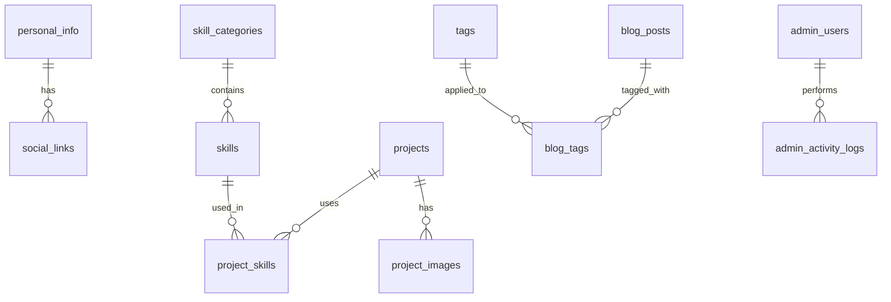

#  Portfolio Server (Backend API)

**Express.js 기반의 고성능 포트폴리오/블로그 백엔드 API 서버**

포트폴리오 프론트엔드와 연동되는 완전한 RESTful API 서버입니다. MySQL 데이터베이스 기반으로 구축되었으며, JWT 인증, 관리자 시스템, 파일 업로드, 캐싱 등 엔터프라이즈급 기능을 제공합니다.

##  목차

- [주요 기능](#-주요-기능)
- [기술 스택](#-기술-스택)
- [프로젝트 구조](#-프로젝트-구조)
- [설치 및 실행](#-설치-및-실행)
- [환경 설정](#-환경-설정)
- [API 문서](#-api-문서)
- [데이터베이스 스키마](#-데이터베이스-스키마)
- [보안 기능](#-보안-기능)
- [성능 최적화](#-성능-최적화)
- [배포 가이드](#-배포-가이드)
- [개발 가이드](#-개발-가이드)

##  주요 기능

###  **포트폴리오 관리**

-  개인 정보 및 소셜 링크 관리
-  프로젝트 포트폴리오 CRUD (상세 설명, 이미지, 데모/깃허브 링크)
-  기술 스택 관리 (카테고리별, 숙련도 표시)
-  경력/경험 관리
-  관심사/취미 관리
-  태그 시스템 및 SEO 최적화

###  **블로그 시스템**

-  블로그 포스트 CRUD (마크다운 지원)
-  포스트 발행/비발행 관리
-  태그 기반 분류 및 검색
-  조회수 추적 및 인기 포스트
-  이미지 업로드 및 관리

###  **관리자 시스템**

-  JWT 기반 인증 및 권한 관리
-  역할 기반 접근 제어 (super_admin, admin, editor)
-  세분화된 권한 시스템
-  관리자 활동 로그 및 감사 추적
-  대시보드 및 통계

###  **연락처 관리**

-  연락처 폼 메시지 수집
-  읽음/읽지 않음 상태 관리
-  이메일 알림 (선택사항)

###  **보안 및 성능**

-  Rate Limiting (DDoS/브루트포스 방지)
-  HTTPS/SSL 지원
-  Helmet.js 보안 헤더
-  Redis 캐싱 (선택사항)
-  파일 업로드 보안
-  SQL 인젝션 방지

##  기술 스택

### **Backend Framework**

- **Express.js** - Node.js 웹 프레임워크
- **Node.js** - JavaScript 런타임

### **데이터베이스**

- **MySQL/MariaDB** - 관계형 데이터베이스
- **MySQL2** - Node.js MySQL 드라이버

### **인증 및 보안**

- **JWT** - JSON Web Token 인증
- **bcryptjs** - 패스워드 해싱
- **Helmet.js** - 보안 헤더 설정
- **express-rate-limit** - Rate Limiting

### **파일 처리**

- **Multer** - 파일 업로드 처리
- **compression** - 응답 압축

### **로깅 및 모니터링**

- **Winston** - 로깅 라이브러리
- **winston-daily-rotate-file** - 로그 로테이션

### **API 문서화**

- **Swagger/OpenAPI** - API 문서 자동 생성
- **swagger-ui-express** - API 문서 UI

### **캐싱 (선택사항)**

- **Redis** - 메모리 캐시
- **node-cache** - 인메모리 캐시

### **AI 통합 (선택사항)**

- **Google Gemini AI** - AI 기반 콘텐츠 생성

##  프로젝트 구조

```
portfolio-server/
├──  server.js                    # 메인 서버 파일
├──  package.json                 # 프로젝트 설정 및 의존성
├──  env.example                  # 환경 변수 예시 파일
├──  db.js                        # 데이터베이스 연결 설정
├──  log.js                       # 로깅 설정
│
├──  models/                      # 데이터베이스 모델
│   ├──  index.js                 # 모델 통합 export
│   ├──  db-utils.js              # DB 유틸리티 함수
│   ├──  personal-info.js         # 개인 정보 모델
│   ├──  projects.js              # 프로젝트 모델
│   ├──  blog-posts.js            # 블로그 포스트 모델
│   ├──  admin-users.js           # 관리자 사용자 모델
│   └── ...                         # 기타 모델들
│
├──  routes/                      # API 라우트
│   ├──  portfolio.js             # 포트폴리오 공개 API
│   ├──  admin.js                 # 관리자 전용 API
│   └──  monitoring.js            # 모니터링 API
│
├──  middleware/                  # 미들웨어
│   └──  auth.js                  # 인증 미들웨어
│
├──  utils/                       # 유틸리티
│   ├──  activity-logger.js       # 활동 로그 유틸리티
│   ├──  cache.js                 # 캐시 유틸리티
│   └──  redis-cache.js           # Redis 캐시 유틸리티
│
├──  services/                    # 외부 서비스
│   └──  gemini-ai.js             # Google Gemini AI 서비스
│
│
├──  uploads/                     # 업로드된 파일
│   └──  images/                  # 이미지 파일들
│
├──  logs/                        # 로그 파일들
│   └──  *.log                    # 일별 로그 파일들
│
├──  setup-database.js            # DB 초기 설정 스크립트
└──  *.md                         # 문서 파일들
```

##  설치 및 실행

### **1. 저장소 클론**

```bash
git clone <repository-url>
cd portfolio-server
```

### **2. 의존성 설치**

```bash
npm install
```

### **3. 환경 변수 설정**

```bash
# .env 파일 생성 및 편집
nano .env
```

### **4. 데이터베이스 설정**

```bash
# 데이터베이스 설정 (필요시)
npm run setup:db
```

### **5. 서버 실행**

```bash
# 개발 모드 (nodemon 사용)
npm run dev

# 프로덕션 모드
npm start
```

서버는 기본적으로 `https://localhost:3001`에서 실행됩니다.

##  환경 설정

### **필수 환경 변수**

```env
# 서버 설정
NODE_ENV=development
PORT=3001
REQUEST_TIMEOUT=3000

# 데이터베이스 설정
DB_HOST=localhost
DB_PORT=3306
DB_USER=root
DB_PASSWORD=your_password
DB_SCHEMA=portfolio_db

# JWT 설정 (보안상 매우 중요!)
JWT_SECRET=your_super_secret_jwt_key_here_make_it_long_and_random
JWT_REFRESH_SECRET=your_super_secret_refresh_key_here

# CORS 설정
LOCALHOST=http://localhost:3000
MY_HOST=https://your-domain.com

# HTTPS 인증서 (프로덕션용)
HTTPS_KEY=/path/to/ssl/private.key
HTTPS_CERT=/path/to/ssl/certificate.crt
HTTPS_CA=/path/to/ssl/ca-bundle.crt
```

### **선택적 환경 변수**

```env
# Redis 캐싱 (선택사항)
REDIS_HOST=localhost
REDIS_PORT=6379
REDIS_PASSWORD=

# AI 서비스 (선택사항)
GEMINI_API_KEY=your_gemini_api_key_here

# 이메일 설정 (연락처 폼용)
SMTP_HOST=smtp.gmail.com
SMTP_PORT=587
SMTP_USER=your_email@gmail.com
SMTP_PASS=your_app_password

# 파일 업로드 설정
MAX_FILE_SIZE=10485760
UPLOAD_PATH=./uploads
ALLOWED_FILE_TYPES=jpg,jpeg,png,gif,webp,pdf,doc,docx
```

##  API 문서

### **Swagger UI 접근**

서버 실행 후 다음 URL에서 API 문서를 확인할 수 있습니다:

- **개발 환경**: `https://localhost:3001/api-docs`
- **프로덕션**: `https://your-domain.com/api-docs`

### **주요 API 엔드포인트**

#### ** 공개 API (인증 불필요)**

```bash
# 포트폴리오 정보
GET /api/personal-info          # 개인 정보
GET /api/social-links           # 소셜 링크
GET /api/skills                 # 기술 스택
GET /api/projects               # 프로젝트 목록
GET /api/projects/:id           # 특정 프로젝트
GET /api/experiences            # 경력/경험
GET /api/interests              # 관심사

# 블로그
GET /api/blog/posts             # 발행된 블로그 포스트
GET /api/blog/posts/:id         # 특정 포스트
GET /api/blog/posts/tag/:tag    # 태그별 포스트
GET /api/blog/search?q=검색어   # 포스트 검색

# 기타
GET /api/settings               # 사이트 설정
POST /api/contact               # 연락처 메시지
GET /api/health                 # 헬스체크
```

#### ** 관리자 API (JWT 인증 필요)**

```bash
# 인증
POST /api/admin/login           # 관리자 로그인
POST /api/admin/logout          # 로그아웃
GET /api/admin/me               # 내 정보
PUT /api/admin/password         # 비밀번호 변경

# 대시보드
GET /api/admin/dashboard        # 대시보드 통계
GET /api/admin/logs             # 활동 로그

# 블로그 관리
GET /api/admin/blog/posts       # 모든 포스트 (비공개 포함)
POST /api/admin/blog/posts      # 새 포스트 생성
PUT /api/admin/blog/posts/:id   # 포스트 수정
DELETE /api/admin/blog/posts/:id # 포스트 삭제
PUT /api/admin/blog/posts/:id/publish # 발행/비발행

# 프로젝트 관리
GET /api/admin/projects         # 모든 프로젝트
POST /api/admin/projects        # 새 프로젝트 생성
PUT /api/admin/projects/:id     # 프로젝트 수정
DELETE /api/admin/projects/:id  # 프로젝트 삭제

# 연락처 관리
GET /api/admin/contacts         # 연락처 메시지
PUT /api/admin/contacts/:id/read # 읽음 처리

# 설정 관리
GET /api/admin/settings         # 사이트 설정
PUT /api/admin/settings         # 설정 업데이트
```

##  데이터베이스 스키마

### **주요 테이블**

| 테이블명           | 설명          | 주요 컬럼                                |
| ------------------ | ------------- | ---------------------------------------- |
| `personal_info`    | 개인 정보     | name, title, bio, email, profile_image   |
| `social_links`     | 소셜 링크     | platform, url, icon, display_order       |
| `skills`           | 기술 스택     | name, proficiency_level, category_id     |
| `projects`         | 프로젝트      | title, description, demo_url, github_url |
| `blog_posts`       | 블로그 포스트 | title, content, is_published, view_count |
| `admin_users`      | 관리자 계정   | username, password_hash, role            |
| `contact_messages` | 연락처 메시지 | name, email, message, is_read            |
| `site_settings`    | 사이트 설정   | key, value, type, is_public              |

### **관계도**



##  보안 기능

### **인증 및 권한**

- **JWT 기반 인증**: Access Token (30분) + Refresh Token (12시간)
- **역할 기반 접근 제어**: super_admin, admin, editor
- **세분화된 권한**: 각 기능별 세밀한 권한 관리
- **세션 관리**: 토큰 해시화 저장 및 검증

### **보안 헤더**

- **Helmet.js**: XSS, CSRF, Clickjacking 방지
- **CORS**: 허용된 도메인만 접근 가능
- **Content Security Policy**: XSS 공격 방지

### **Rate Limiting**

- **일반 API**: 1분에 300회 요청
- **관리자 API**: 1분에 100회 요청
- **로그인 API**: 15분에 5회 시도

### **입력 검증**

- **SQL 인젝션 방지**: Parameterized queries 사용
- **파일 업로드 보안**: 파일 타입 및 크기 제한
- **XSS 방지**: 입력 데이터 sanitization

##  성능 최적화

### **캐싱 전략**

- **Redis 캐시**: 자주 조회되는 데이터 캐싱
- **인메모리 캐시**: 설정값 및 정적 데이터 캐싱
- **HTTP 캐시**: 정적 파일 캐싱 헤더

### **데이터베이스 최적화**

- **인덱스 최적화**: 자주 조회되는 컬럼에 인덱스
- **쿼리 최적화**: N+1 문제 방지, JOIN 최적화
- **연결 풀링**: 데이터베이스 연결 재사용

### **압축 및 최적화**

- **Gzip 압축**: 응답 크기 70-90% 감소
- **이미지 최적화**: WebP 형식 지원
- **번들 최적화**: 불필요한 모듈 제거

##  배포 가이드

### **PM2를 사용한 배포 (권장)**

```bash
# PM2 전역 설치
npm install -g pm2

# 애플리케이션 시작
pm2 start ecosystem.config.js

# 프로세스 저장 (재부팅 시 자동 시작)
pm2 save
pm2 startup
```

### **Docker를 사용한 배포**

```bash
# Docker 이미지 빌드
docker build -t portfolio-server .

# 컨테이너 실행
docker run -d \
  --name portfolio-server \
  -p 3001:3001 \
  -v /path/to/.env:/app/.env \
  portfolio-server
```

### **Nginx 리버스 프록시**

```nginx
server {
    listen 443 ssl http2;
    server_name yourdomain.com;

    ssl_certificate /path/to/ssl/certificate.crt;
    ssl_certificate_key /path/to/ssl/private.key;

    location /api {
        proxy_pass https://localhost:3001;
        proxy_set_header Host $host;
        proxy_set_header X-Real-IP $remote_addr;
    }

    location /uploads {
        alias /var/www/portfolio-server/uploads;
        expires 1y;
    }
}
```

자세한 배포 가이드는 [DEPLOYMENT_GUIDE.md](./DEPLOYMENT_GUIDE.md)를 참고하세요.

## ‍ 개발 가이드

### **개발 환경 설정**

```bash
# 개발 의존성 설치
npm install --dev

# 개발 모드로 실행 (nodemon 사용)
npm run dev


# 로그 확인
tail -f logs/$(date +%Y-%m-%d).log
```

### **코딩 컨벤션**

- **ESLint**: 코드 품질 검사
- **Prettier**: 코드 포맷팅
- **JSDoc**: 함수 문서화
- **Swagger**: API 문서화

### **테스트**

```bash
# API 테스트 (예시)
curl -X GET https://localhost:3001/api/health
curl -X GET https://localhost:3001/api/blog/posts
```

### **디버깅**

```bash
# 상세 로그 활성화
LOG_LEVEL=debug npm run dev

# 특정 모듈 디버깅
DEBUG=portfolio:* npm run dev
```

##  모니터링

### **헬스체크**

```bash
# 서버 상태 확인
curl https://localhost:3001/health
```

응답 예시:

```json
{
  "status": "healthy",
  "timestamp": "2024-01-15T10:30:00.000Z",
  "uptime": "3600s",
  "memory": {
    "rss": "45MB",
    "heapTotal": "20MB",
    "heapUsed": "15MB"
  },
  "cache": {
    "stats": {
      "hits": 150,
      "misses": 25,
      "hitRate": "85.7%"
    }
  }
}
```

### **로그 관리**

- **일별 로그 로테이션**: 자동으로 오래된 로그 압축/삭제
- **로그 레벨**: error, warn, info, debug
- **구조화된 로깅**: JSON 형식으로 상세 정보 기록

##  기여하기

1. Fork the Project
2. Create your Feature Branch (`git checkout -b feature/AmazingFeature`)
3. Commit your Changes (`git commit -m 'Add some AmazingFeature'`)
4. Push to the Branch (`git push origin feature/AmazingFeature`)
5. Open a Pull Request

##  라이선스

이 프로젝트는 MIT 라이선스 하에 배포됩니다. 자세한 내용은 [LICENSE](LICENSE) 파일을 참고하세요.

##  지원

- **이메일**: support@portfolio.com
- **이슈 트래커**: GitHub Issues
- **문서**: [Wiki](https://github.com/your-repo/wiki)

---

**⭐ 이 프로젝트가 도움이 되었다면 스타를 눌러주세요!**

---

##  추가 문서

- [ 관리자 시스템 가이드](./ADMIN_GUIDE.md) - 관리자 인증 및 권한 관리
- [ 배포 가이드](./DEPLOYMENT_GUIDE.md) - 프로덕션 배포 방법
- [ 로그 가이드](./LOG_GUIDE.md) - 로깅 시스템 사용법
- [ 데이터베이스 문서](./README-DB.md) - DB 설정 및 관리

##  버전 히스토리

- **v2.1.0** - AI 통합, 성능 최적화, 보안 강화
- **v2.0.0** - 관리자 시스템, JWT 인증, 권한 관리
- **v1.0.0** - 기본 포트폴리오/블로그 API
